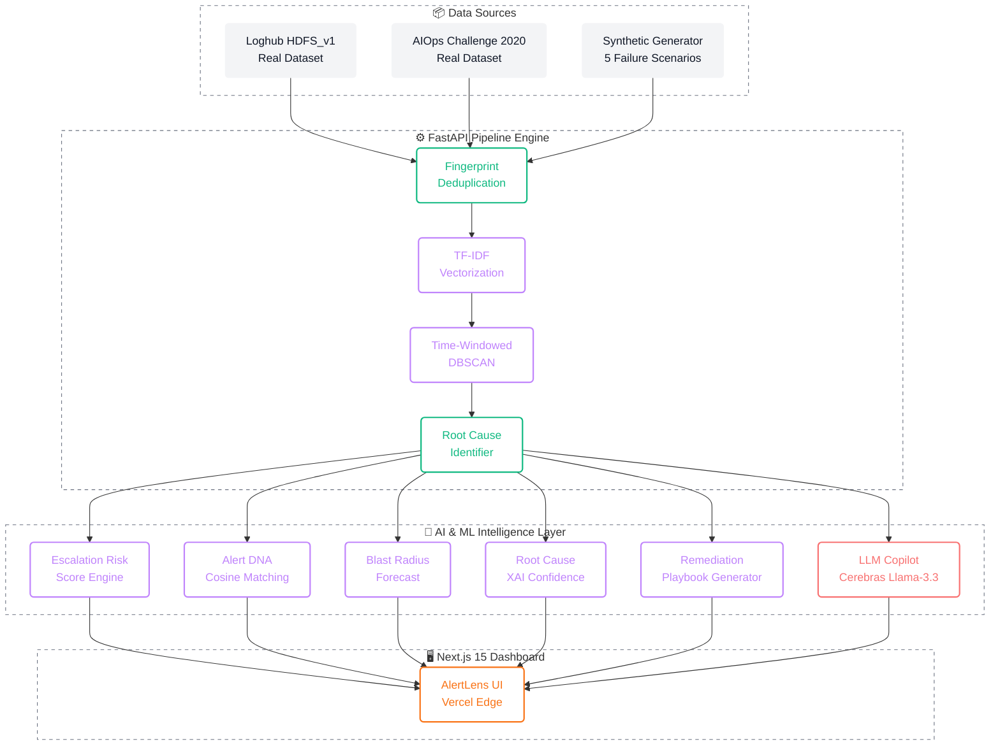

<div align="center">

# 🚨 AlertLens

### Intelligent Alert Correlation & Deduplication Engine

**Synergy 2026 · HPE Problem Statement #10**

[](https://hpe-hackathon-alert-correlation-ded-eta.vercel.app)
[](https://fastapi.tiangolo.com)
[](https://nextjs.org)
[](https://python.org)
[](https://vercel.com)

<br/>

> _Turning infrastructure noise into actionable, prioritized intelligence._

<br/>

<kbd>

</kbd>
&nbsp;
<kbd>

</kbd>
&nbsp;
<kbd>

</kbd>

</div>

<br/>

---

## 📋 Table of Contents

- [The Problem](#-the-problem-alert-storms)
- [The Solution](#-the-solution-intelligent-alert-correlation)
- [Key Features](#-key-features)
- [System Architecture](#-system-architecture)
- [Pipeline Deep Dive](#-pipeline-deep-dive)
- [Technology Stack](#-technology-stack)
- [Project Structure](#-project-structure)
- [Getting Started](#-getting-started)
- [Deployment](#-deployment)
- [Datasets](#-datasets)
- [Feature Roadmap](#-feature-roadmap)

---

## 🌩️ The Problem: Alert Storms

In modern microservice architectures, **one single infrastructure failure triggers hundreds of downstream alerts within minutes.**

Engineers spend the critical first 15 minutes of a major incident simply sifting through the noise, trying to figure out what actually broke. Existing systems rely on static rules that are hard to maintain and fail when novel incidents occur.

<div align="center">

```
┌──────────────────────────────────────────────────────────────┐
│                    ONE DB CONNECTION FAILURE                  │
│                            │                                 │
│              ┌─────────────┼─────────────┐                   │
│              ▼             ▼             ▼                   │
│        ┌──────────┐ ┌──────────┐ ┌──────────┐               │
│        │ API GW   │ │ Order    │ │ Payment  │               │
│        │ Timeout  │ │ Service  │ │ Service  │               │
│        │ ×24      │ │ 5xx ×18  │ │ Fail ×31 │               │
│        └──────────┘ └──────────┘ └──────────┘               │
│              │             │             │                   │
│              ▼             ▼             ▼                   │
│        150+ ALERTS IN 3 MINUTES — WHICH IS THE ROOT CAUSE?  │
└──────────────────────────────────────────────────────────────┘
```

</div>

---

## 💡 The Solution: Intelligent Alert Correlation

AlertLens doesn't just silence alerts — it **collapses the flood into a handful of actionable incidents**, identifies the root cause, and tells you how to fix it.

> **TL;DR:** Correlation tells you _what broke_. AlertLens tells you _what's about to break worse_, _how it was fixed last time_, _why the root cause was selected_, and provides a _step-by-step SRE runbook_ to resolve it.

---

## ✨ Key Features

<table>
<tr>
<td width="50%">

### 🔬 Core Intelligence
| # | Feature | What it does |
|---|---------|-------------|
| 1 | **Fingerprint Deduplication** | Collapses identical alerts via `(service, alertname, 5-min window)` hashing |
| 2 | **TF-IDF + DBSCAN Correlation** | Semantically clusters related alerts using time-windowed density clustering |
| 3 | **Root Cause Identification** | Pinpoints the earliest alert in each cluster — failures propagate forward in time |
| 4 | **Escalation Risk Score** | Real-time 0→1 signal: `0.40·growth + 0.35·severity + 0.25·spread` |

</td>
<td width="50%">

### 🧠 Advanced AI
| # | Feature | What it does |
|---|---------|-------------|
| 5 | **Alert DNA Matching** | Cosine similarity against past incidents: _"87% similar to INC-0412"_ |
| 6 | **LLM Copilot (Cerebras)** | Plain English summaries + interactive incident chat via Llama-3.3-70b |
| 7 | **Predictive Blast Radius** | 15-min horizon forecasts for risk, alert volume, and service spread |
| 8 | **Root Cause Confidence (XAI)** | Explainable ranking of candidate services with rejection reasons |

</td>
</tr>
<tr>
<td>

### 🛠️ Operational Tools
| # | Feature | What it does |
|---|---------|-------------|
| 9 | **AI Remediation Playbook** | Step-by-step SRE runbooks with risk badges, rollback plans, health checks |
| 10 | **Interactive Terminal** | Simulated execution environment for remediation commands |
| 11 | **Chaos Injector** | 5 production failure scenarios to test the full pipeline end-to-end |
| 12 | **Storm Replay Engine** | Replay alert batches at variable speed to observe cascade formation |

</td>
<td>

### 📊 Forensic Analysis
| # | Feature | What it does |
|---|---------|-------------|
| 13 | **Incident Time Machine** | Step-through forensic replay: raw → dedup → cluster → risk → DNA |
| 14 | **Historical Comparator** | PR-style visual diff against institutional memory |
| 15 | **Service Topology Map** | Interactive DAG visualization of service dependencies |
| 16 | **Pipeline Evaluation** | Real-time accuracy metrics: precision, recall, F1-score |

</td>
</tr>
</table>

---

## 🏗️ System Architecture



---

## 🔍 Pipeline Deep Dive

Each alert passes through a **12-stage pipeline** — from raw ingestion to actionable incident card:

| Stage | Name | Implementation | Key Files |
|:---:|------|----------------|-----------|
| **1** | **Ingestion** | Three switchable sources: Loghub HDFS_v1, AIOps Challenge 2020, and a multi-source synthetic generator with 5 cascading failure scenarios. Switch live via the Dataset dropdown. | `data/loghub_hdfs_loader.py` · `data/aiops_challenge_loader.py` · `data/synthetic_alert_generator.py` |
| **2** | **Deduplication** | Fingerprint hashing of `(service, alertname, 5-min window)` — Alertmanager-style. Collapses redundant spikes without losing signal. | `backend/app/dedup.py` |
| **3** | **Vectorization** | TF-IDF embedding of alert message text. Lightweight alternative to transformer models — blazing fast with minimal memory footprint. | `backend/app/clustering.py` |
| **4** | **Correlation** | Time-windowed DBSCAN clustering on TF-IDF vectors. Parameters grid-searched against ground truth labels. | `backend/app/clustering.py` |
| **5** | **Root Cause Analysis** | Identifies the earliest alert in each cluster — failures propagate forward in time. | `backend/app/clustering.py` |
| **6** | **Escalation Risk Score** | Heuristic formula: `0.40·growth + 0.35·severity + 0.25·spread`. Fully normalized (0→1), explainable. | `backend/app/risk_score.py` |
| **7** | **Alert DNA Matching** | Cosine similarity between cluster centroids and past incident TF-IDF vectors. Surfaces historical resolutions for novel-but-similar issues. | `backend/app/alert_dna.py` |
| **8** | **LLM Summarization** | Translates multi-service clusters into plain English. Powers the interactive AI Copilot via **Cerebras Llama-3.3-70b**. | `backend/app/summarizer.py` · `backend/app/assistant.py` |
| **9** | **Blast Radius Forecast** | 15-minute horizon step projections (+5m, +10m, +15m) for risk escalation, alert volume growth, and downstream service spread. | `backend/app/forecast.py` |
| **10** | **Root Cause Confidence (XAI)** | Explainable ranking of candidate services with normalized confidence scores (0→100%) and candidate rejection explanations across 5 heuristic signals. | `backend/app/root_cause_confidence.py` |
| **11** | **Remediation Playbook** | AI-generated step-by-step SRE runbooks with duration/risk badges, health validation checklists, rollback procedures, and interactive simulation mode. | `backend/app/playbook.py` |
| **12** | **Evaluation** | Real-time precision, recall, F1-score against ground truth. MTTR & triage time savings calculated per resolved incident. | `backend/app/main.py` |

---

## 🛠️ Technology Stack

<table>
<tr>
<td valign="top" width="50%">

### Backend & Data Science
| Technology | Purpose |
|-----------|---------|
| **Python 3.9+** | Core language |
| **FastAPI** | High-performance async API server |
| **Scikit-Learn** | TF-IDF vectorization + DBSCAN clustering |
| **NumPy** | Fast vector operations |
| **SQLAlchemy** | Alert persistence & state management |
| **Cerebras API** | Llama-3.3-70b inference (AI Copilot + Summarizer) |
| **Pydantic v2** | Request/response validation |

</td>
<td valign="top" width="50%">

### Frontend & Visualization
| Technology | Purpose |
|-----------|---------|
| **Next.js 15** | React framework with App Router + Turbopack |
| **TypeScript** | Type-safe component development |
| **TailwindCSS** | Utility-first styling with dark mode |
| **Tremor** | Data visualization components |
| **Headless UI** | Accessible UI primitives (drawers, modals) |
| **Dagre + React Flow** | Interactive service topology DAG |
| **Vercel** | Edge deployment with API rewrites |

</td>
</tr>
</table>

---

## 📁 Project Structure

```
AlertLens/
├── backend/
│   ├── app/
│   │   ├── main.py                  # FastAPI app — all pipeline endpoints
│   │   ├── dedup.py                 # Fingerprint deduplication layer
│   │   ├── clustering.py            # TF-IDF + DBSCAN correlation engine
│   │   ├── risk_score.py            # Escalation risk score calculator
│   │   ├── alert_dna.py             # Historical incident DNA matching
│   │   ├── forecast.py              # Blast radius 15-min forecast engine
│   │   ├── root_cause_confidence.py # XAI confidence ranking
│   │   ├── playbook.py              # AI remediation playbook generator
│   │   ├── summarizer.py            # LLM summarization (Cerebras)
│   │   ├── assistant.py             # Interactive AI Copilot
│   │   ├── automation.py            # Workflow rule evaluation
│   │   ├── db.py                    # SQLAlchemy alert persistence
│   │   └── models.py               # Pydantic data models
│   └── requirements.txt
│
├── data/
│   ├── synthetic_alert_generator.py # Multi-scenario alert generator
│   ├── loghub_hdfs_loader.py        # Loghub HDFS_v1 dataset loader
│   ├── aiops_challenge_loader.py    # AIOps Challenge 2020 loader
│   └── seed_incident_library.json   # Historical incident knowledge base
│
├── frontend-next/                   # Next.js 15 dashboard (production)
│   ├── app/(keep)/                  # App Router pages
│   │   ├── feed/                    # Alert Feed view
│   │   ├── incidents/               # Incident detail + comparator
│   │   ├── correlations/            # DBSCAN cluster visualization
│   │   ├── deduplication/           # Dedup statistics
│   │   ├── topology/               # Service dependency DAG
│   │   ├── forecast/               # Blast radius predictions
│   │   ├── timemachine/            # Forensic incident replay
│   │   ├── evaluation/             # Pipeline accuracy metrics
│   │   └── pipeline/               # End-to-end pipeline view
│   ├── entities/alertlens/          # AlertLens domain layer
│   └── components/
│       ├── chaos/                   # Chaos injection scenarios
│       └── remediation/             # Interactive terminal modal
│
├── notebooks/
│   └── poc_clustering.ipynb         # Research notebook: clustering PoC
│
└── README.md
```

---

## 🚀 Getting Started

### Prerequisites

| Requirement | Version |
|-------------|---------|
| Python | 3.9+ |
| Node.js | 18+ |
| npm | 9+ |
| Cerebras API Key | Optional (for AI features) |

### 1️⃣ Backend Setup

```bash
# Clone the repository
git clone https://github.com/Aditya0105singh/HPE--HACKATHON-ALERT-CORRELATION-DEDUPLICATION.git
cd HPE--HACKATHON-ALERT-CORRELATION-DEDUPLICATION

# Install backend dependencies
pip install -r backend/requirements.txt

# (Optional) Set your Cerebras API key for AI features
echo "CEREBRAS_API_KEY=your_key_here" > .env

# One-time: Build the Loghub HDFS_v1 alert batch
# Downloads + caches HDFS_v1.zip from Zenodo (~187MB)
python data/loghub_hdfs_loader.py

# One-time: Build the AIOps Challenge 2020 alert batch
# Reads fault-injection CSV via HTTP range requests
python data/aiops_challenge_loader.py

# Start the FastAPI server
uvicorn app.main:app --app-dir backend --reload --port 8001
```

> 🟢 API available at `http://localhost:8001` · Interactive docs at `http://localhost:8001/docs`

### 2️⃣ Frontend Setup

```bash
# Navigate to the frontend
cd frontend-next

# Install dependencies
npm install

# Start the Next.js dev server (Turbopack)
npm run dev
```

> 🟢 Dashboard available at `http://localhost:3000`

### 3️⃣ Quick Test

Once both servers are running:
1. Open `http://localhost:3000`
2. Click any **Dataset** button (Synthetic / Loghub / AIOps) on the Home page
3. The full pipeline runs automatically — watch alerts collapse into correlated incidents in real time

---

## 🌐 Deployment

The application is architected for **zero-cost deployment** on modern PaaS platforms:

| Layer | Platform | Details |
|-------|----------|---------|
| **Frontend** | **Vercel** | Connect the GitHub repo and deploy `frontend-next/`. API requests are proxied to the backend via middleware rewrites — zero CORS issues. |
| **Backend** | **Render** | Deploy as a Python Web Service on Render's Free Tier. TF-IDF (not heavy neural nets) means the entire backend runs comfortably within **512MB RAM**. Set `CEREBRAS_API_KEY` in the dashboard. |

**Live deployment:** [**hpe-hackathon-alert-correlation-ded-eta.vercel.app**](https://hpe-hackathon-alert-correlation-ded-eta.vercel.app)

---

## 📊 Datasets

AlertLens supports **three switchable data sources**, all running through the same pipeline:

| Dataset | Type | Size | Source |
|---------|------|------|--------|
| **Synthetic Generator** | Generated | ~120 alerts/batch | 5 cascading failure scenarios with ground-truth labels |
| **Loghub HDFS_v1** | Real-world | ~11M log lines → alerts | [Zenodo / Loghub](https://zenodo.org/records/8196385) — real HDFS block-level anomaly labels |
| **AIOps Challenge 2020** | Real-world | Fault-injection logs → alerts | [AIOps Challenge](http://iops.ai/competition_detail/?competition_id=15) — real production fault injection |

> Switch between datasets live via the **Dataset** dropdown in the top bar — no restart needed.

---

## ✅ Feature Roadmap

- [x] Synthetic multi-source alert generator with ground-truth labels
- [x] Fingerprint deduplication layer
- [x] TF-IDF + time-windowed DBSCAN correlation (grid-searched)
- [x] Escalation Risk Score (explainable heuristic)
- [x] Alert DNA past-incident matching
- [x] FastAPI ingestion & pipeline endpoints
- [x] Full Next.js 15 dashboard (Feed, Dedup, Correlations, Incidents, Topology)
- [x] LLM Integration: AI Copilot + Incident Summaries (Cerebras Llama-3.3-70b)
- [x] Real AIOps datasets: Loghub HDFS_v1 + AIOps Challenge 2020
- [x] Predictive Blast Radius Forecast (15-min horizon)
- [x] Incident Time Machine (forensic replay)
- [x] Historical Incident Comparator (PR-style diff)
- [x] Root Cause Confidence Graph (XAI decision transparency)
- [x] AI Remediation Playbook (SRE runbooks + simulation mode)
- [x] Chaos Injector (5 production failure scenarios)
- [x] Interactive Terminal (simulated command execution)
- [x] Storm Replay Engine (variable-speed alert replay)
- [x] Pipeline Evaluation (precision, recall, F1, MTTR savings)
- [x] SQLite persistence layer for alert state
- [x] Workflow automation rule engine

---

## 👥 Team

Built for **Synergy 2026 — HPE Problem Statement #10**

---

<div align="center">

<br/>

**⚡ AlertLens** — _From 150 alerts to 1 actionable incident in under 2 seconds._

<br/>

[](https://github.com/Aditya0105singh/HPE--HACKATHON-ALERT-CORRELATION-DEDUPLICATION)
[](https://hpe-hackathon-alert-correlation-ded-eta.vercel.app)

</div>
